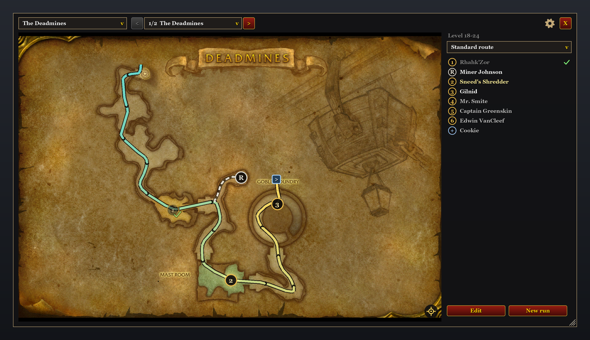
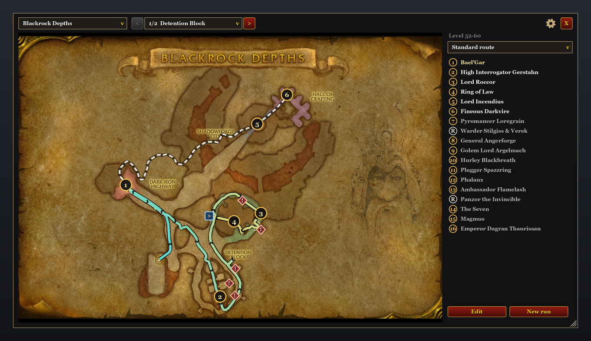
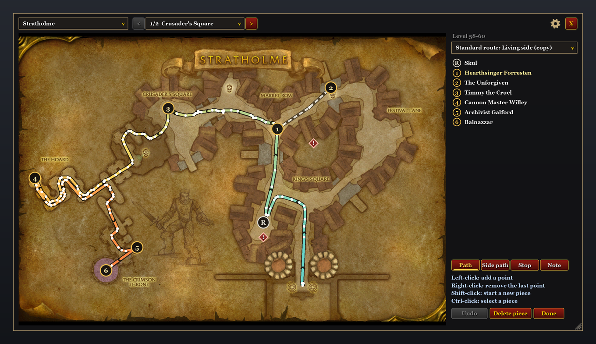

# Forever Dungeon Routes

A dungeon map with routes for **World of Warcraft: Forever**. Ready routes for the classic dungeons,
boss order and notes, bosses that tick themselves off, and an editor for your own routes in the
spirit of Mythic Dungeon Tools.

| Browsing Blackrock Depths | Editing a copy of a standard route |
|---|---|
|  |  |

These are preview images, not in-game screenshots: the addon's own code runs against a replica of
the game's interface functions, and every frame, line and texture it creates is drawn with the map
art from the game client. Fonts and buttons are close approximations. In-game screenshots will
replace them.

## Features

- Own map window with the game's dungeon map art. WoW: Forever has no dungeon maps of its own, but
  the art files are still in the game client; the addon draws them itself. No other addon needed.
- Standard routes for all 24 classic dungeons. The line color runs from the entrance to the last
  boss, arrows show the walking direction, dashed lines mark side paths.
- Numbered bosses in route order, rares (`R`), optional bosses (`+`) and notes (`!`) with keys,
  events and quest items. Blue squares switch to the next map level.
- Inside a dungeon the map follows your run: after a boss kill it shows the level of the next open
  boss. WoW gives addons no position inside dungeons (since patch 7.1), so there is no arrow for
  you or your group.
- Stop list with checkmarks per character. Bosses tick themselves off when the game reports the
  kill; rares without a boss fight are ticked by hand. "New run" clears the checkmarks, an old run
  is cleared after three hours.
- Boss names in the language of your game client (from the game's own boss list).
- Route editor: paths, side paths, stops and notes; drag to move, undo. Editing a standard route
  creates a copy.
- Share routes with your group in game: everyone with the addon gets the route offered and takes it
  over with one click. Or share them as text (export and import).
- Button at the minimap, slash command and key binding.
- English and German.

## Install

1. Download `ForeverDungeonRoutes-<version>.zip` from the [releases](../../releases).
2. Unzip it into `World of Warcraft\<Forever folder>\Interface\AddOns\`. The folder must be named
   `ForeverDungeonRoutes`.

## Use

- The button at the minimap or `/fdr` opens or closes the map. Drag the button to move it around
  the minimap. There is also a key binding (Key Bindings, section AddOns).
- Choose the dungeon and the map level in the header. Inside a dungeon the window opens on the
  level of the next open boss.
- Mouse wheel zooms, dragging moves the map, right-click zooms out. After you choose a level by
  hand the map stays there; the crosshair button shows the next open boss and lets the map follow
  your run again.
- Bosses tick themselves off when they die. A click on a boss on the map or in the list ticks it
  off by hand. Shift-click a list entry to show it on the map.
- Click the route name to choose a route, create a new one, copy, rename, delete, export or import.
- "Send to group" in the same menu (or `/fdr send`) sends the active route to your party or raid.
  Group members with the addon are asked whether to take it over; nothing changes without their
  yes. A standard route travels as a short hint, an own route in small pieces (up to about half a
  minute for the largest ones). During boss fights the game holds addon messages back; sending
  then waits until the fight is over.
- The gear button holds the settings: stop list, arrows, tick off bosses automatically, open
  automatically in dungeons, button at the minimap, line width, opacity.

Stratholme, Maraudon and Dire Maul North come with two standard routes each (living and undead
side, purple and orange side, full clear and tribute run).

## Own routes

"Edit" on a standard route creates a copy, the standard route itself stays unchanged.
While editing:

- **Path / Side path**: left-click adds a point, right-click removes the last one, shift-click
  starts a new piece, ctrl-click selects an existing piece.
- **Stop**: left-click places a stop. On a stop: click for options (rename, note, kind, boss in the
  game, order), drag to move, right-click to delete. A stop named like one of the dungeon's bosses
  is linked to that boss and ticks itself off.
- **Note**: left-click places a note. On a note: click to edit, drag to move, right-click to delete.
- **Undo** reverts the last change, **Done** ends editing. Right-drag moves the map while editing.

Your own routes work for every dungeon: choose the dungeon and "New route".

## Commands

`/fdr` shows or hides the map, `/fdr send` sends the active route to your group, `/fdr reset`
clears the checkmarks, `/fdr pos` prints the position data (helps with bug reports).

## Dungeons with a standard route

Ragefire Chasm, The Deadmines, Wailing Caverns, Shadowfang Keep, Blackfathom Deeps, The Stockade,
Razorfen Kraul, Gnomeregan, Scarlet Monastery (Graveyard, Library, Armory, Cathedral),
Razorfen Downs, Uldaman, Zul'Farrak, Maraudon, Temple of Atal'Hakkar, Blackrock Depths,
Lower Blackrock Spire, Dire Maul (East, West, North), Scholomance, Stratholme.

## How the map works

The addon ships no map art. It shows the game's own dungeon map files by their file IDs
(`Data/Floors.lua`, generated from Blizzard's map tables). Inside dungeons the game gives addons
no position, so the map follows the boss kills the game reports. In Scarlet Monastery and Dire
Maul a kill also tells which wing you are in.

## Credits

The standard routes were traced from the dungeon walkthrough maps of aetherflask.com, which went
offline in 2022 and are mirrored at [eintr.net](https://eintr.net/WoW/World-of-Warcraft-Classic-Dungeon-Walkthrough.html).
For the Temple of Atal'Hakkar and parts of Scholomance those maps served as a guide for the boss
order; the paths follow the corridors of the game's map. Boss names come from the game's boss list.

## License

MIT, see [LICENSE](LICENSE).
